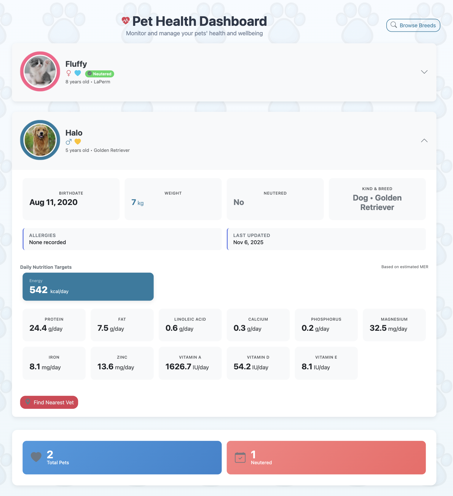
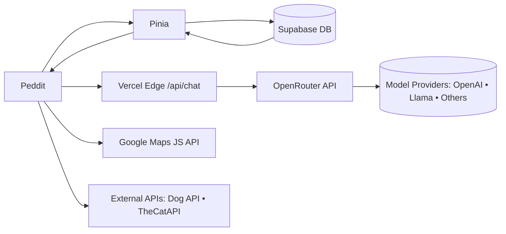

# Peddit

Your pet social network and nutrition dashboard.

[Live App](https://peddit-coral.vercel.app/) • Vercel CD • Vue 3 + Vite + Pinia • Supabase

      

Peddit is a full-stack web app for pet owners to:
- Create pet profiles, track health, and analyze nutrition of pets
- Build and share recipes and meals
- Post socially and interact with the community
- Find nearby pet stores and clinics with Google Maps
- Get AI assistance via an integrated chatbot

## Key Features
- Authentication: Email Magic Link + Google OAuth (Supabase)
- Social: Reddit Style social featurs with Votes, Comments, sharing posts and meal plans
- Pet Health: Dashboard, nutrient breakdowns, requirements, targets
- Recipes & Meals: Creation, editing, shopping list helpers
- Maps: Nearby pet stores and vet clinics with sorting/filters
- AI Chatbot: OpenRouter proxy via Vercel Edge function, streaming replies

## Screenshots
- Dashboard: `src/assets/dashboard.png`
- Nutrition: `src/assets/nutrition.png`
- Recipes: `src/assets/recipe.png`
- Social: `src/assets/social.png`
- Maps: `src/assets/location.png`
- Chatbot: `src/assets/chatbot.png`

Example embeds:

## Architecture

## Tech Stack
- Frontend: Vue 3, Pinia, VueUse, Bootstrap 5, UIVerse components, Motion‑V (Framer Motion for Vue)
- Backend: Supabase (Auth + Database)
- Edge API: Vercel Edge Function proxy for OpenRouter (`api/chat.js`)
- Build/Tooling: Vite, vite-plugin-vue-devtools, dotenv
- Hosting: Vercel (SPA rewrite to `index.html`)
- External APIs: Google Maps, OpenRouter (OpenAI-compatible), Dog API, TheCatAPI

## Project Structure
- `src/main.js`: App bootstrap
- `src/App.vue`: Root layout, feature toggles (chatbot)
- `src/router/index.js`: Routes + auth guards
- `src/lib/supabaseClient.js`: Supabase client
- `src/lib/chatApi.js`: Chat API (proxy-aware + streaming)
- `src/stores/*`: Pinia stores (auth, posts, pets, profiles, comments, follows, toast, nutrition)
- `src/components/*`: Atomic/atoms/molecules/organisms + social/profile/maps/chatbot
- `src/views/*`: Page views (Home, Health, Profile, Social, Map, Pet, Recipe, etc.)
- `api/chat.js`: Vercel Edge function proxy to OpenRouter
- `vite.config.js`: Dev server proxy (optional), aliases, CSP headers
- `vercel.json`: Build output + SPA rewrites
- `.github/workflows/deploy.yml`: GitHub Pages build (optional)

## Environment Variables
Frontend (`.env.local`):
- `VITE_SUPABASE_URL` — Supabase Project URL
- `VITE_SUPABASE_PUBLISHABLE_KEY` — Supabase anon/publishable key
- `VITE_GOOGLE_MAPS_API_KEY` — Google Maps JS API key
- `VITE_CHATBOT_ENABLED` — `'true'` to show chatbot UI
- `VITE_CHAT_PROXY_URL` — Chat proxy URL (e.g., `/api/chat`)
- `VITE_CHAT_MODEL` — Default model (e.g., `openrouter/auto`)
- `VITE_CHAT_SIMPLE_MODEL` — Simple/fast model
- `VITE_CHAT_THINKING_MODEL` — Reasoning‑capable model

Edge/Server (Vercel Project Settings → Environment Variables):
- `OPENROUTER_API_KEY` — OpenRouter API key (used by `api/chat.js`)

Example: see `.env.example` and populate missing keys for local dev.

Security note: Never commit real secrets. Rotate any accidentally committed keys.

## Local Development
- Node: `>=20.19` (see `package.json`)
- Install: `npm i`
- Run: `npm run dev`
- Build: `npm run build`
- Preview: `npm run preview`

## Scripts
- `dev` — Vite dev server
- `build` — Production build to `dist/`
- `preview` — Preview build
- `predeploy`/`deploy` — Static deploy helpers (GitHub Pages fallback)

## Deployment
- Vercel
  - Build command: `npm run build`
  - Output dir: `dist`
  - SPA rewrites: handled via `vercel.json`
  - Add `OPENROUTER_API_KEY` in Project Env for chat proxy
- GitHub Pages (optional)
  - Workflow present: `.github/workflows/deploy.yml`
  - Uploads `dist` as Pages artifact after `npm run build`

## Edge Chat Proxy
- `api/chat.js` exposes a CORS-enabled POST endpoint at `/api/chat`
- Proxies request bodies to `https://openrouter.ai/api/v1/chat/completions`
- Reads `OPENROUTER_API_KEY` (set in Vercel env)
- Frontend calls are defined in `src/lib/chatApi.js` (JSON and streaming modes)

## Routing & Guards
- Public: `/`, `/login` (hidden when authed), `/social`, `/meal`, `/chatbot`, `/map`, `/profile/:username`, `/viewpost/:postId`, `/view-recipe-post/:postId`
- Private: `/home`, `/health`, `/profile`, `/pet`, `/create-pet`, `/add-meal-plan`, `/edit-pet`, `/edit-meal`
- Guard: Supabase session validation via `src/stores/authStore.js`

## Contributors
- [Bernard Chua Kim Swee](https://github.com/Bernardcks) — Supabase, Authentication, Profiles and Pet Health
- [Dwayne Arnold Aniban Otero](https://github.com/oreoolis) — Pet, Recipe, Shopping List Business Logic and Live Deployment
- [Jereme Tan Jing Min](https://github.com/jerememetan) — UI Designer, Social Media Business Logic
- [Than Wei Lin](https://github.com/than-wl) — AI Chatbot, AI Wrapper Implementation
- [Nicholas Xie](https://github.com/RayleighCN) — Pet Store Location Recommendation and Landing Page
